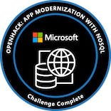

```
    ___   __                  _      __  ___                 _   __              __
   /   | / /_____  ____ ___  (_)____/  |/  /__  ____ _____ _/ | / /__  _________/ /
  / /| |/ __/ __ \/ __ `__ \/ / ___/ /|_/ / _ \/ __ `/ __ `/  |/ / _ \/ ___/ __  /
 / ___ / /_/ /_/ / / / / / / / /__/ /  / /  __/ /_/ / /_/ / /|  /  __/ /  / /_/ /
/_/  |_\__/\____/_/ /_/ /_/_/\___/_/  /_/\___/\__, /\__,_/_/ |_/\___/_/   \__,_/
                                             /____/
```

- 🤖 Greetings, I am @AtomicMegaNerd.
- 👋 你好。我在学习中文。虽然学中文有点难，我还喜欢这样做。很高兴认识你！
- 🐍 At work I have used a lot of Python and Java.  I am learning Go.  I have also coded in Scala, C++, JavaScript (and variants like TypeScript), PHP, and even Lua. Rust is a language I'd like to get into more.
- 🐟 I love the fish shell because it is awesome.
- 🥷 I am also learning how to become a speedy code ninja in neovim.  LSP and tmux make neovim awesome!  This is how I write code these days.
- 💻 I spend most of my computing time on UNIX-based systems like macOS and Linux.
- 🐧 My favourite Linux distro is Pop!\_OS.  Window tiling is amazing.
- 🛠 Other tools that I love include Alacritty on Linux, iTerm and Amethyst on the Mac, and the modern UNIX stuff like exa, bat, duf, dust, and htop.

## Exercism

I enjoy doing programming language exercises on Exercism.  Here is my profile: 
[https://exercism.org/profiles/AtomicMegaNerd](https://exercism.org/profiles/AtomicMegaNerd)

## Training



[https://www.credly.com/badges/3d9d55be-2c43-4783-b6f8-22a1999d7774/public_url](https://www.credly.com/badges/3d9d55be-2c43-4783-b6f8-22a1999d7774/public_url)
